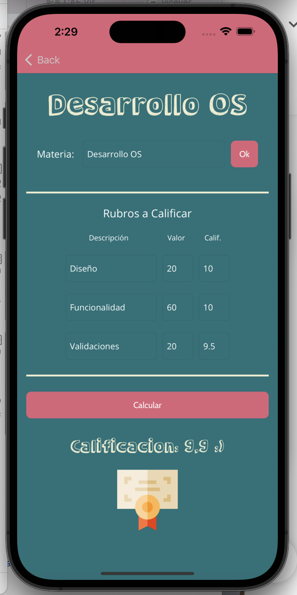
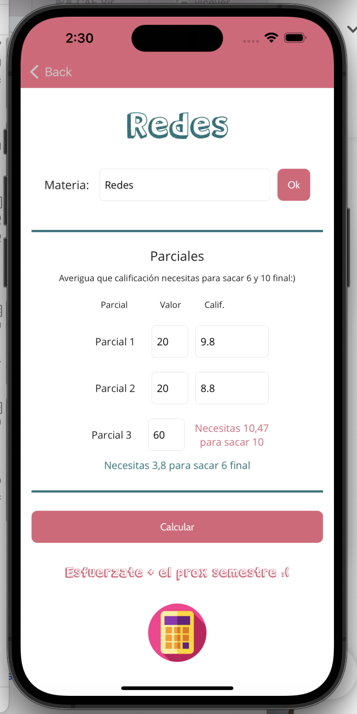

# Gradee - Calculadora de Califiaciones
Calculadora de calificaciones por materia y semestral con .NET MAUI, desarrollo móvil

### Capturas de pantalla:

Página de Bienvenida, elige que calificación quieres calcular

Validaciones

Calcula la calificación de una materia con base a 2 rubros, sus porcentajes y calificación de cada rubro

Calcula la calificación que tienes que sacar en tercer parcial con base a las 2 calificaciones de los parciales anteriores para sacar 10 o 6 final

